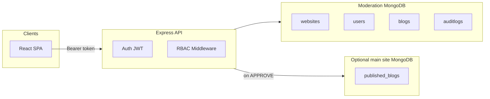

# Blog Moderation Platform (MERN)

A **multi-tenant** blog workflow: many **websites** are managed from one API; each site has its own **categories** and **employees**. Employees submit posts (with images) for **moderation**; only **approved** posts are public. Posts in the moderation database are subject to a **7-day TTL** on `createdAt` (MongoDB TTL index).

---

## Architecture at a glance



- **Frontend** (`frontend/`): Vite + React, calls the API via `/api` (proxied in dev).
- **Backend** (`backend/`): Express, Mongoose, JWT (`HS256`), role-based access.
- **Primary database** (`MONGODB_URI`): websites, users, blogs, audit logs.
- **Optional secondary database** (`MAIN_SITE_MONGODB_URI`): when set, approving a blog **upserts** a copy into collection `published_blogs` for a separate “main website” consumer.

---

## Tech stack

| Layer | Technology |
|--------|------------|
| API | Node.js 18+, Express 4 |
| Data | MongoDB, Mongoose 8 |
| Auth | `jsonwebtoken`, `bcryptjs` |
| Uploads | `multer` (memory), images stored as buffer + data-URL `imageUrl` |
| Security | `helmet`, `cors`, `express-rate-limit`, `express-validator`, `sanitize-html` |
| Frontend | React 18, React Router 6, Axios, Vite 5, `react-easy-crop`, DOMPurify |

---

## Repository layout

```
DEMO_BLOGPOOSTER/
├── backend/
│   ├── config/          # db.js (primary), mainDb.js (published copy)
│   ├── controllers/     # auth, blog, website, admin
│   ├── middleware/      # auth, validate, sanitize, upload, errors
│   ├── models/          # User, Website, Blog, AuditLog
│   ├── routes/          # auth, blogs, websites, admin
│   ├── scripts/seed.js  # demo data + accounts
│   ├── server.js
│   └── .env.example
├── frontend/
│   ├── src/
│   │   ├── pages/       # login, employee, admin, public
│   │   ├── components/  # layout, cropper, cards
│   │   └── services/api.js
│   └── vite.config.js   # proxy /api → backend
└── README.md
```

---

## Prerequisites

- **Node.js** ≥ 18  
- **MongoDB** running locally (or a reachable Atlas URI)  
- For the SPA in development: backend on the port in `PORT` (default **5000**), frontend on **5173**

---

## Environment variables

Copy `backend/.env.example` to `backend/.env` and adjust.

| Variable | Required | Description |
|----------|----------|-------------|
| `MONGODB_URI` | Yes | Primary DB for moderation app (websites, users, blogs, audits). |
| `JWT_SECRET` | Yes | Secret for signing JWTs (use a long random string in production). |
| `JWT_EXPIRES_IN` | No | Token lifetime (default `8h`). |
| `PORT` | No | API port (default `5000`). |
| `CORS_ORIGINS` | No | Comma-separated allowed browser origins (e.g. `http://localhost:5173`). |
| `FRONTEND_ORIGIN` | No | Legacy single-origin fallback for CORS parsing. |
| `NODE_ENV` | No | `production` hides some error details in JSON responses. |
| `MAIN_SITE_MONGODB_URI` | No | If set, **approve** upserts into `published_blogs` in this database. |

Frontend optional: `VITE_API_URL` — if unset, the client uses `/api` (Vite proxy in dev).

---

## Database structure

### Primary database (`MONGODB_URI`)

Mongoose **collection names** default to lowercase pluralized model names unless overridden.

#### `users`

| Field | Type | Notes |
|-------|------|--------|
| `_id` | ObjectId | |
| `email` | String | Unique, lowercased |
| `password` | String | Bcrypt hash, not selected by default |
| `role` | `ADMIN` \| `EMPLOYEE` | |
| `isActive` | Boolean | Default `true`; `false` blocks login |
| `websiteId` | ObjectId ref `Website` | Required for `EMPLOYEE`; `null` for `ADMIN` |
| `createdAt`, `updatedAt` | Date | From `timestamps: true` |

Indexes: `email` (unique), `websiteId`, `isActive`.

#### `websites`

| Field | Type | Notes |
|-------|------|--------|
| `name`, `domain` | String | `domain` unique |
| `categories` | Array of `{ name, slug }` | Slugs unique **within** the website |
| `createdAt`, `updatedAt` | Date | |

#### `blogs`

| Field | Type | Notes |
|-------|------|--------|
| `title`, `description`, `content` | String | Content sanitized server-side |
| `authorName` | String | |
| `publishDate` | Date | |
| `imageUrl` | String | Typically a `data:` URL for API responses |
| `image.data` | Buffer | Raw bytes (omitted from most API responses via `.select('-image')`) |
| `image.contentType` | String | e.g. `image/jpeg` |
| `authorId` | ObjectId ref `User` | |
| `websiteId` | ObjectId ref `Website` | |
| `category` | `{ name, slug }` | Copied from website category at create time |
| `status` | `PENDING` \| `APPROVED` \| `REJECTED` | Default `PENDING` |
| `createdAt` | Date | **TTL index**: documents removed **7 days** after `createdAt` |

Compound indexes support listing by website, status, category, and author.

#### `auditlogs`

| Field | Type |
|-------|------|
| `actorId` | ObjectId (admin user) |
| `action` | String (e.g. `EMPLOYEE_CREATE`, `EMPLOYEE_UPDATE`) |
| `targetUserId` | ObjectId optional |
| `websiteId` | ObjectId optional |
| `meta` | Object |
| `createdAt`, `updatedAt` | Date |

### Secondary database (`MAIN_SITE_MONGODB_URI`) — optional

Collection **`published_blogs`** (explicit name in code):

| Field | Notes |
|-------|--------|
| `sourceBlogId` | Unique — moderation `Blog._id` |
| `websiteId`, `category`, `title`, `description`, `content`, `authorName`, `publishDate`, `imageUrl` | Snapshot at approve time |
| `createdAt` | Optional metadata |

Written with **`updateOne` + `upsert`** when an admin approves a pending post and this URI is configured.

---

## Authentication

- **Login**: `POST /auth/login` with JSON `{ "email", "password" }` returns `{ token, user }`.
- **Protected routes**: header `Authorization: Bearer <JWT>`.
- Tokens are signed with **algorithm `HS256`**. On each request, the server loads the user from the DB and enforces **`role`**, **`websiteId`**, and **`isActive`** (not only the JWT payload).

**Roles**

- **ADMIN**: all websites; moderation; employee CRUD; no `websiteId` required on user record.
- **EMPLOYEE**: exactly one `websiteId`; can only access that site’s categories and create/list own blogs.

---

## API reference

Base URL **without** proxy: `http://localhost:<PORT>` (e.g. `5000`).  
With the React dev server, requests use **`/api`** prefix (Vite strips `/api` when proxying).

### Health

| Method | Path | Auth | Description |
|--------|------|------|-------------|
| GET | `/health` | No | `{ ok, uptime }` |

### Auth

| Method | Path | Auth | Body | Description |
|--------|------|------|------|-------------|
| POST | `/auth/login` | No | `{ email, password }` | Returns JWT + user (`id`, `email`, `role`, `websiteId`). Rate-limited (`/auth`). |

### Websites (employee)

| Method | Path | Auth | Description |
|--------|------|------|-------------|
| GET | `/websites/:websiteId/categories` | Bearer, **EMPLOYEE** with matching `websiteId` | Returns website categories for the employee’s site. |

### Blogs — employee

| Method | Path | Auth | Description |
|--------|------|------|-------------|
| GET | `/blogs/my` | Bearer, **EMPLOYEE** | Paginated list of blogs by logged-in author. |
| POST | `/blogs` | Bearer, **EMPLOYEE** | **Multipart**: field `image` (file) + `title`, `description`, `content`, `authorName`, `publishDate` (ISO string optional), `categorySlug`. Creates `PENDING` blog for `req.auth.websiteId`. |

**Query for `GET /blogs/my`**

| Param | Description |
|-------|-------------|
| `page`, `limit` | Pagination (default limit 20, max 100) |
| `status` | Optional: `PENDING`, `APPROVED`, `REJECTED` |

### Blogs — public (no auth)

Responses use **`imageUrl`** and omit raw `image` bytes.

| Method | Path | Query | Description |
|--------|------|-------|-------------|
| GET | `/blogs/:websiteId` | `page`, `limit` | Approved posts for site, paginated. |
| GET | `/blogs/:websiteId/latest` | `limit` (default 10, max 50) | Latest approved posts. |
| GET | `/blogs/:websiteId/category/:slug` | `page`, `limit` | Approved posts in category. |
| GET | `/blogs/:websiteId/post/:blogId` | — | Single approved post. |

**Note:** `GET /blogs/my` is registered **before** `GET /blogs/:websiteId` so `/my` is not parsed as a website id.

### Admin (all require Bearer **ADMIN**)

#### Websites & moderation

| Method | Path | Query / body | Description |
|--------|------|--------------|-------------|
| GET | `/admin/websites` | — | All websites with `name`, `domain`, `categories`. |
| GET | `/admin/blogs/:websiteId` | `status` (default `PENDING`), `page`, `limit` | Blogs for moderation queue. |
| GET | `/admin/blogs/detail/:id` | — | Full blog for preview (`-image`, populated `authorId`). |
| PUT | `/admin/blogs/approve/:id` | — | If pending: optional upsert to main DB, then set `APPROVED`. |
| PUT | `/admin/blogs/reject/:id` | — | Set `REJECTED` if pending. |

#### Employee management

| Method | Path | Body / query | Description |
|--------|------|--------------|-------------|
| POST | `/admin/employees` | `{ email, password, websiteId }` | Create employee; password must pass strength policy. |
| GET | `/admin/employees` | `page`, `limit`, `q` (email search), `websiteId` | List employees. |
| PUT | `/admin/employees/:id` | `{ email?`, `websiteId?` } | Update email and/or site. |
| PATCH | `/admin/employees/:id/status` | `{ isActive` boolean `}` | Enable/disable account. |
| POST | `/admin/employees/:id/reset-password` | `{ password }` | New password (strength rules). |
| DELETE | `/admin/employees/:id` | — | Delete employee user. |

**Password policy** (create / reset): at least **8** characters, at least one **letter**, one **digit**, and one **symbol**.

---

## Rate limiting

- **`/auth/*`**: stricter window (e.g. 50 requests / 15 minutes per IP) — returns JSON `429` with `{ message }`.
- **Global API limiter**: higher cap; **skips** rate limit for selected `GET` paths used heavily by the UI (`/websites/:id/categories`, `/blogs/...`, `/blogs/my`, `/health`).

---

## Frontend routes (React)

| Path | Role | Purpose |
|------|------|---------|
| `/login` | — | Login |
| `/dashboard/employee` | EMPLOYEE | Category grid → create post per category |
| `/dashboard/employee/create/:categorySlug` | EMPLOYEE | Blog form + image cropper |
| `/dashboard/employee/my-blogs` | EMPLOYEE | Own posts + status filters |
| `/dashboard/admin` | ADMIN | Sites, pending list, full preview, approve/reject |
| `/dashboard/admin/employees` | ADMIN | Employee CRUD |
| `/site/:websiteId` | Public | Approved blogs for one website |
| `/site/:websiteId/post/:blogId` | Public | Single approved post |

---

## User flows (how the site works)

1. **Admin** logs in → selects a website → sees pending blogs → opens detail → **Approve** or **Reject**. Approve may **mirror** the post into `MAIN_SITE_MONGODB_URI` / `published_blogs`.
2. **Employee** logs in → loads categories for their `websiteId` → picks a category → fills the form, crops/uploads cover image → **POST /blogs** → post is **PENDING**.
3. **Public** opens `/site/<websiteId>` (use id from seed or admin) → only **APPROVED** content appears; detail pages use `/site/:websiteId/post/:blogId`.

**Multi-tenant rule:** Employees never send `websiteId` in the create body; the API uses `req.auth.websiteId` from the database.

---

## Seed data

From `backend/`:

```bash
npm run seed
```

Requires `MONGODB_URI` in `backend/.env`. The script **clears** `blogs`, `users`, and `websites`, then inserts demo websites, categories, and users. Default password for seeded accounts (see `scripts/seed.js`): **`Password123!`**

Example accounts (after seed):

- `admin@demo.com` — ADMIN  
- `alice@techpulse.demo` — EMPLOYEE (TechPulse site)  
- `bob@lifencode.demo` — EMPLOYEE (Life & Code site)  

---

## Run locally

**Terminal 1 — MongoDB**  
Ensure `mongod` is running (or use Atlas and set `MONGODB_URI`).

**Terminal 2 — API**

```bash
cd backend
npm install
# copy .env.example to .env and set MONGODB_URI, JWT_SECRET
npm run seed
npm run dev
```

**Terminal 3 — Frontend**

```bash
cd frontend
npm install
npm run dev
```

Open `http://localhost:5173`. The app calls `/api`, which Vite proxies to the backend.

**Production build (frontend):** `cd frontend && npm run build` — serve `dist/` behind a host that proxies `/api` to the API or set `VITE_API_URL` to the full API origin.

---

## Error responses

Common shapes:

- `{ "message": "..." }`
- Validation: `{ "message": "Validation failed", "errors": [...] }` (express-validator)
- `401` / `403` for auth/role/disabled account  
- `429` JSON for rate limit

---

## Security notes (summary)

- JWT with fixed algorithm; user re-loaded per request; inactive users blocked.  
- HTML in blog **content** sanitized; plain-text fields stripped of HTML.  
- Image upload: MIME whitelist and size limit in multer config.  
- CORS allowlist via `CORS_ORIGINS` / `FRONTEND_ORIGIN`.  
- Helmet enabled; JSON body size limit on Express.

For integrating a **real** main website, consume **`published_blogs`** in the secondary database (or call the moderation API’s public endpoints against the same moderation DB — your deployment choice).

---

## License

This is a demo project; add a license file if you distribute it.
